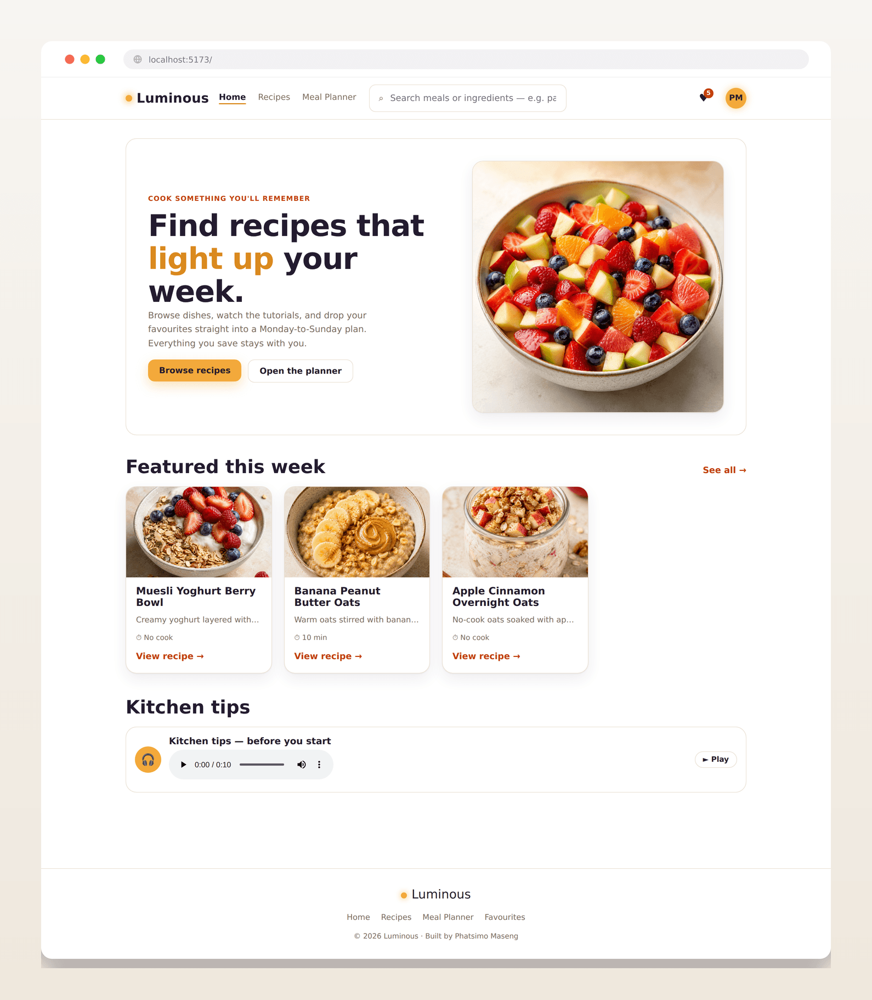
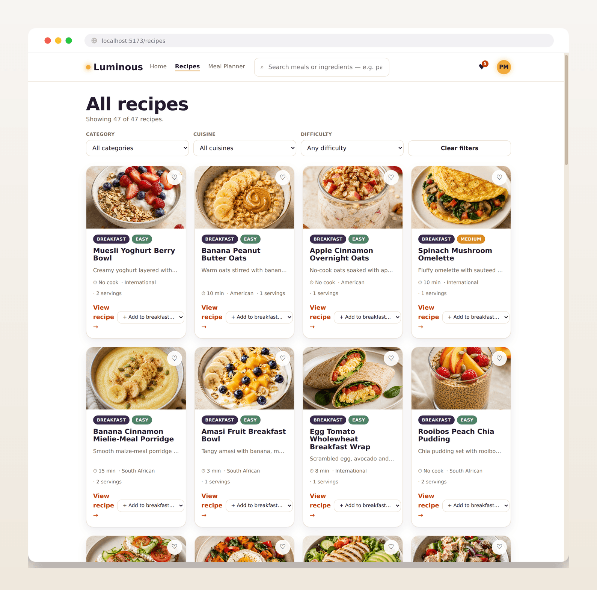
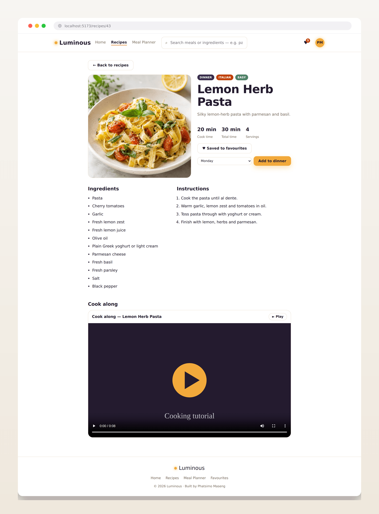
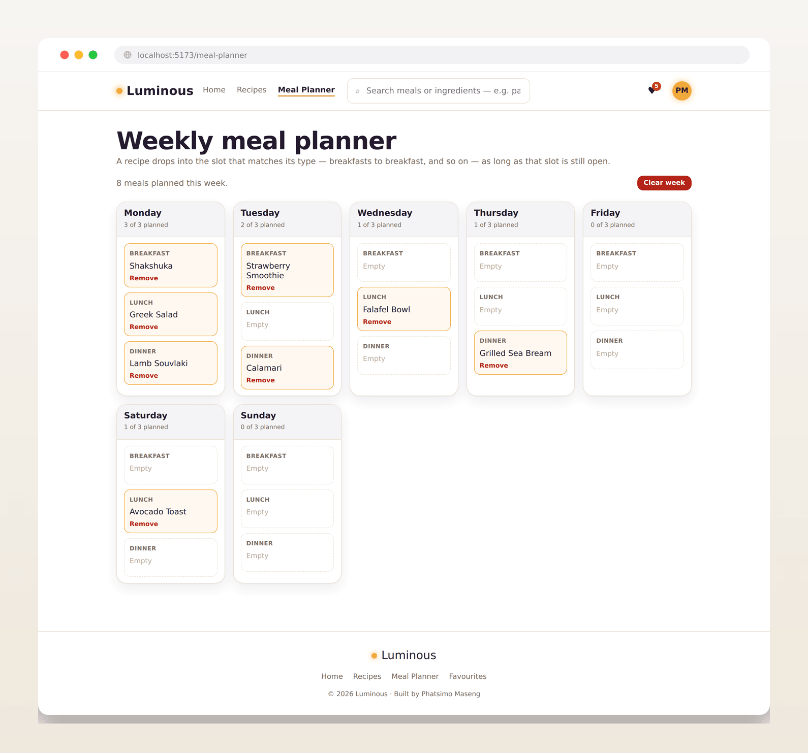
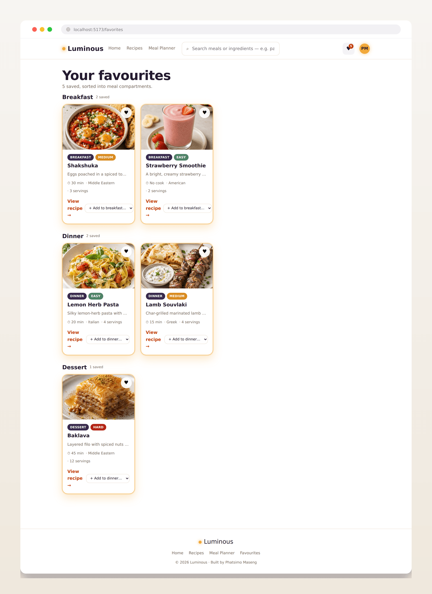

# Luminous — Recipe Discovery & Meal Planning

## Introduction

Luminous is a responsive React application for discovering recipes, watching cook-along
tutorials, saving favourites, and planning a full Monday-to-Sunday week of meals. It is
built entirely with functional components and hooks, and ships with 47 sample recipes
spanning breakfast, lunch, dinner, dessert, and snacks.

## What the App Does

- Browse all 47 recipes, or search by name, cuisine, or ingredient
- Filter recipes by category, cuisine, and difficulty, with a clear-filters control
- View full recipe detail: ingredients, step-by-step instructions, cook and total time, servings
- Watch an embedded cooking tutorial video on each recipe (HTML5 video with controls)
- Listen to a cooking-tips audio guide on the home page (HTML5 audio with controls)
- Mark recipes as favourites; favourites persist and show a live count in the navbar
- Plan a week of meals across seven day cards, each with breakfast, lunch, and dinner slots
- Add a recipe to the slot matching its meal type, remove single meals, or clear the whole week
- Favourites and the weekly plan persist in localStorage between sessions
- Responsive across mobile, tablet, and desktop, with a dedicated 404 page

## Screenshots

### Home page


### Recipes page with filters


### Recipe detail with video


### Meal planner


### Favourites



## Accessibility

The app is live — click the link below to open it:

**[Open Luminous](https://codeswithbux.github.io/React_Recipe_App/)**

To run Luminous on your own machine instead, download or clone the repository, then install
the dependencies and start the development server:

```bash
git clone https://github.com/CodesWithBux/React_Recipe_App.git
cd React_Recipe_App
npm install
npm run dev
```

Open the local address the terminal prints (for example `http://localhost:5173/`) in your
browser. To create a production build, run `npm run build`.

## Project Structure

```
React_Recipe_App/
├── public/
│   └── assets/
│       ├── images/
│       ├── videos/
│       └── audio/
├── screenshots/
├── src/
│   ├── components/
│   │   ├── common/        (Navbar, Footer, AccountBadge)
│   │   ├── UI/            (Button, Card, SearchBar, Loading, Modal, Badge)
│   │   ├── Recipe/        (RecipeCard, RecipeList, RecipeDetail, RecipeFilter)
│   │   ├── MealPlanner/   (MealPlanner, DayCard, MealSlot)
│   │   └── Media/         (VideoPlayer, AudioPlayer)
│   ├── pages/             (Home, RecipesPage, MealPlannerPage, FavoritesPage, NotFound)
│   ├── data/             (recipesData.js — 47 recipes)
│   ├── utils/            (helpers.js)
│   ├── App.jsx
│   ├── App.css
│   └── main.jsx
├── index.html
├── package.json
├── vite.config.js
├── PLANNING.md
└── README.md
```

## Programming Languages and Technologies Used

- **JavaScript (ES6+)** and **JSX** — the core language and syntax of the application
- **HTML5** — semantic markup and native `<video>` / `<audio>` elements
- **CSS3** — styled with CSS Modules, plus inline and conditional styles
- **React 18** — functional components, `useState`, `useEffect`
- **React Router DOM 6** — routing, dynamic route parameters, active-link styling, and programmatic navigation across six routes (`/`, `/recipes`, `/recipes/:id`, `/meal-planner`, `/favorites`, and a 404 route)
- **PropTypes** — prop validation across components
- **Vite 5** — build tool and development server
- **Git and GitHub** — version control and hosting

## Reflection

Building Luminous from scratch taught me how a React application holds together as a system
rather than a set of separate files. Planning the component hierarchy first made the rest
easier: I could see where shared state belonged, and lifting favourites and the meal plan up
to the top-level component kept every page in sync. Working with hooks showed me how state
drives what the user sees, and how `useEffect` with localStorage lets choices survive a
refresh.

The biggest lesson was that deploying is different from running locally. On my own machine
everything worked, but the live build behaved differently: it is served from a sub-path, so I
had to configure the build's base path, adjust the router, and correct the way asset paths were
written before the images and media loaded correctly. Learning to read what was actually
deployed, rather than assuming, is what finally got it working.

---

Built by Phatsimo Maseng.
